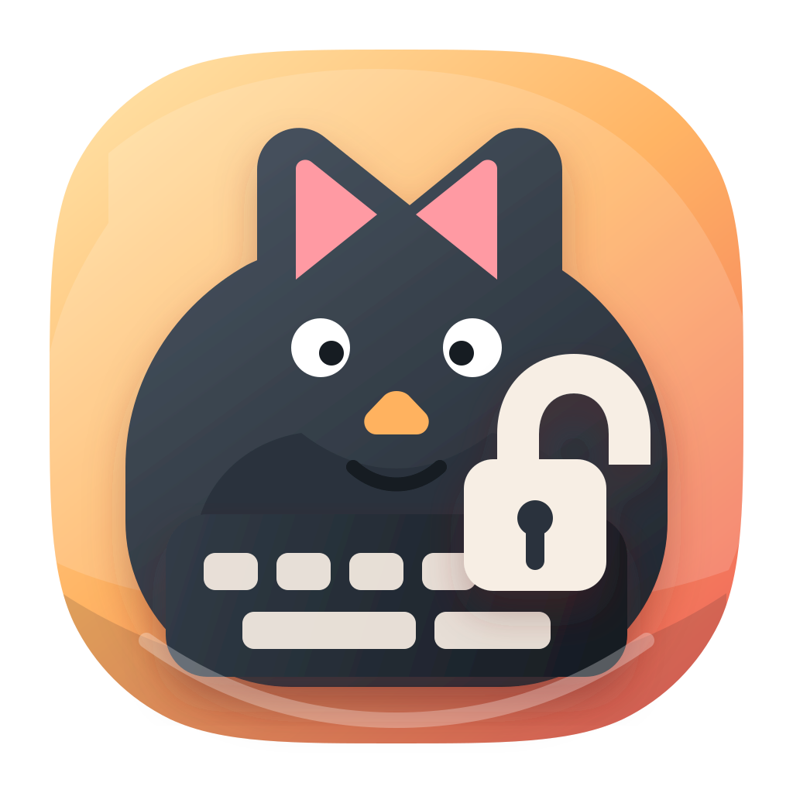

<p align="center">
  
</p>

<h1 align="center">Cat Lock</h1>

<p align="center">
  <strong>Lock the keyboard. Keep your Mac awake.</strong><br>
  For cats, kids, and cleaning — with a timed escape route that always works.
</p>

<p align="center">
  <a href="#install">Install</a> · <a href="#what-it-does">What it does</a> ·
  <a href="#faq">FAQ</a> · <a href="PRIVACY.md">Privacy</a> ·
  <a href="TERMS.md">Terms</a>
</p>

Cat Lock is a small macOS menu bar utility for temporarily blocking accidental
input while the Mac stays awake and visible. It is built around recovery first:
every lock has a timeout, a fallback shortcut, and disappears if the app quits.

## What it does

- **Lock with a click or trigger corner** — start from the menu bar, or throw
  the pointer into a selected screen corner when a cat jumps on the desk.
- **Show the locked state** — the screen edges breathe orange while input is
  blocked, so a quiet keyboard does not become a mystery.
- **Timed auto-unlock** — choose 5, 10, 30, or 60 minutes.
- **Escape shortcut** — hold `Control + Option + Command + L` for one second.
- **Keyboard first** — clicks are blocked only when you explicitly enable it;
  pointer movement remains available for recovery.
- **Crash-safe by design** — the event filter belongs to the app process, so
  quitting or crashing restores normal input.

## Install

> Requires macOS 13 Ventura or later.

The Mac App Store listing will be linked here when Cat Lock is released.
Until then, build it from source:

```sh
./script/build_and_run.sh
```

The script stages the app at `dist/CatKeyboardLock.app`. Grant Accessibility
permission to that staged app, and avoid running a second copy from Xcode at
the same time.

## Permissions

Cat Lock needs macOS **Accessibility** permission because `CGEventTap` is the
system API used to suppress input events. It does not read, store, or transmit
the contents of keys or clicks. Trigger-corner monitoring only checks the
current pointer position while the feature is enabled.

## Cat Lock Pro

The full lock flow is available during the app-managed two-day Pro trial and
after a one-time purchase. The trial starts from the app's onboarding flow and
does not renew or charge automatically.

- **Lifetime** — $6.99
- **Supporter Lifetime** — $10.99

Both purchases unlock the same features. Apple and RevenueCat process the
purchase and entitlement data; Cat Lock does not receive payment-card details.
Prices shown in the store may be localized by territory.

## FAQ

**What if I cannot unlock the keyboard?**

Hold `Control + Option + Command + L` for one second, or wait for the selected
timeout. If Cat Lock quits, the event filter disappears with it.

**Does Cat Lock record what I type?**

No. Input events are suppressed locally only during an active lock. Key codes,
typed text, click locations, and pointer coordinates are not stored or sent.

**Does it block the mouse?**

Only if click blocking is enabled in Settings. Pointer movement is never
blocked, so the trigger corner and recovery path remain reachable.

**Why does it need Accessibility?**

macOS requires Accessibility permission for apps that filter input through
`CGEventTap`. Cat Lock uses that access only while the user has activated a
lock.

## Development

```sh
# Build and run
./script/build_and_run.sh

# Verify the staged app and configuration
./script/build_and_run.sh --verify

# Test deterministic lock and access rules
./script/catlock_core.sh matrix

# Capture UI smoke screenshots
./script/catlock_ui.sh smoke

# Run app tests
xcodebuild test -project CatKeyboardLock.xcodeproj \
  -scheme CatKeyboardLock \
  -destination 'platform=macOS,arch=arm64'
```

See [Docs/Architecture.md](Docs/Architecture.md), [Docs/Testing.md](Docs/Testing.md),
and [Docs/RevenueCat.md](Docs/RevenueCat.md) for implementation and release
notes.

## Privacy and terms

Cat Lock collects no analytics or telemetry. See the [Privacy Policy](PRIVACY.md)
and [Terms of Use](TERMS.md).

## About

Built by [chenfeng](https://github.com/Feng6611) — I make small, focused Mac
utilities. More: [Command Reopen](https://commandreopen.com) ·
[Clipboard Drop](https://apps.apple.com/app/id6768068044) ·
[Obsidian plugins](https://github.com/Feng6611)

## License

[MIT](LICENSE)
