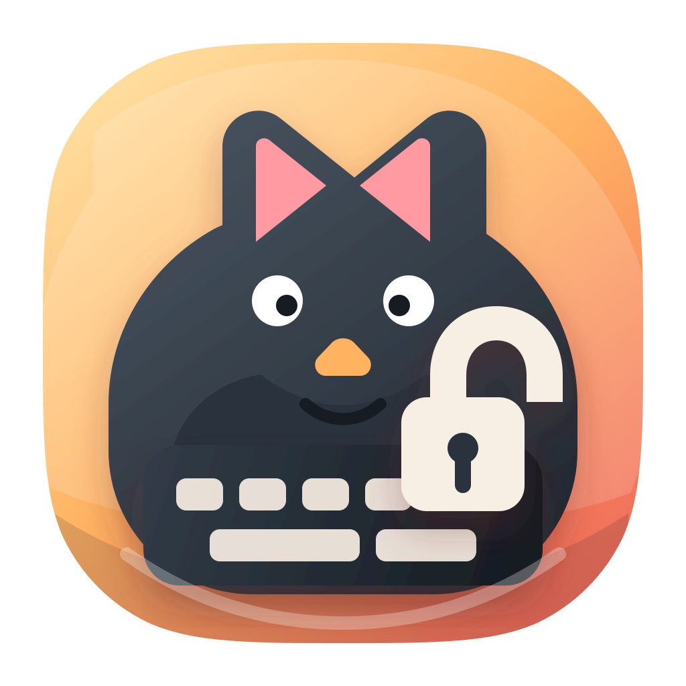

<p align="center">
  
</p>

<h1 align="center">Cat Lock</h1>

<p align="center">
  <strong>Lock the keyboard. Keep your Mac awake.</strong><br>
  For cats, kids, and cleaning — with a timed escape route that always works.
</p>

<p align="center">
  <a href="#install">Install</a> · <a href="#what-it-does">What it does</a> ·
  <a href="#faq">FAQ</a> · <a href="PRIVACY.md">Privacy</a> ·
  <a href="TERMS.md">Terms</a>
</p>

Cat Lock is a small macOS menu bar utility for temporarily blocking accidental
input while the Mac stays awake and visible. It is built around recovery first:
every lock has a timeout, an unlock path that never depends on the keyboard,
and disappears if the app quits.

## What it does

- **Lock with a click or trigger corner** — start from the menu bar, or throw
  the pointer into a selected screen corner when a cat jumps on the desk.
- **Show the locked state** — the screen edges breathe orange while input is
  blocked, so a quiet keyboard does not become a mystery.
- **Timed auto-unlock** — choose 5, 10, 30, or 60 minutes.
- **Unlock without the keyboard** — click the menu bar item, or hold the
  pointer in the trigger corner; pointer movement is never blocked.
- **Keyboard first** — clicks are blocked only when you explicitly enable it;
  pointer movement remains available for recovery.
- **Crash-safe by design** — the event filter belongs to the app process, so
  quitting or crashing restores normal input.

## Install

> Requires macOS 13 Ventura or later.

The Mac App Store listing will be linked here when Cat Lock is released.
Until then, build it from source:

```sh
./script/build_and_run.sh
```

The script stages the app at `dist/CatKeyboardLock.app`. Grant Accessibility
permission to that staged app, and avoid running a second copy from Xcode at
the same time.

## Permissions

Cat Lock needs macOS **Accessibility** permission because `CGEventTap` is the
system API used to suppress input events. It does not read, store, or transmit
the contents of keys or clicks. Trigger-corner monitoring only checks the
current pointer position while the feature is enabled.

## Free forever

Cat Lock's keyboard and click locking features are available indefinitely.
There is no trial, subscription, in-app purchase, or account requirement.
If the app helps you, you can optionally
[buy the cat a can](https://buymeacoffee.com/kkuk?utm_source=catlock-readme).

## FAQ

**What if I cannot unlock the keyboard?**

Pointer movement is never blocked, so there is always a way out. If only the
keyboard is locked, click the Cat Lock menu bar item. If clicks are locked too,
hold the pointer in the trigger corner, or wait for the selected timeout.
Quitting Cat Lock removes the event filter with it.

**Does Cat Lock record what I type?**

No. Input events are suppressed locally only during an active lock. Key codes,
typed text, click locations, and pointer coordinates are not stored or sent.

**Does it block the mouse?**

Only if click blocking is enabled in Settings. Pointer movement is never
blocked, so the trigger corner and recovery path remain reachable.

**Why does it need Accessibility?**

macOS requires Accessibility permission for apps that filter input through
`CGEventTap`. Cat Lock uses that access only while the user has activated a
lock.

## Development

```sh
# Build and run
./script/build_and_run.sh

# Verify the staged app and configuration
./script/build_and_run.sh --verify

# Test deterministic lock and access rules
./script/catlock_core.sh matrix

# Capture UI smoke screenshots
./script/catlock_ui.sh smoke

# Run app tests
xcodebuild test -project CatKeyboardLock.xcodeproj \
  -scheme CatKeyboardLock \
  -destination 'platform=macOS,arch=arm64'
```

See [Docs/Architecture.md](Docs/Architecture.md) and [Docs/Testing.md](Docs/Testing.md)
for implementation and release notes.

## Privacy and terms

Cat Lock collects no analytics or telemetry. See the [Privacy Policy](PRIVACY.md)
and [Terms of Use](TERMS.md).

## About

Built by [chenfeng](https://github.com/Feng6611) — I make small, focused Mac
utilities. More: [Command Reopen](https://commandreopen.com) ·
[Clipboard Drop](https://apps.apple.com/app/id6768068044) ·
[Obsidian plugins](https://github.com/Feng6611)

## License

[MIT](LICENSE)
